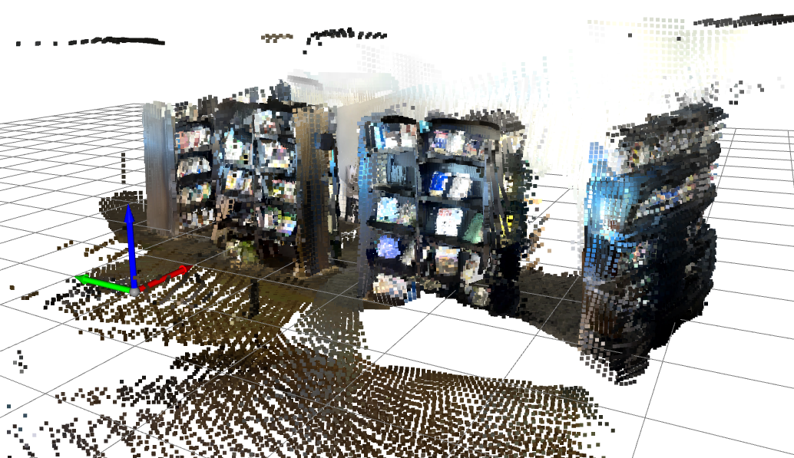
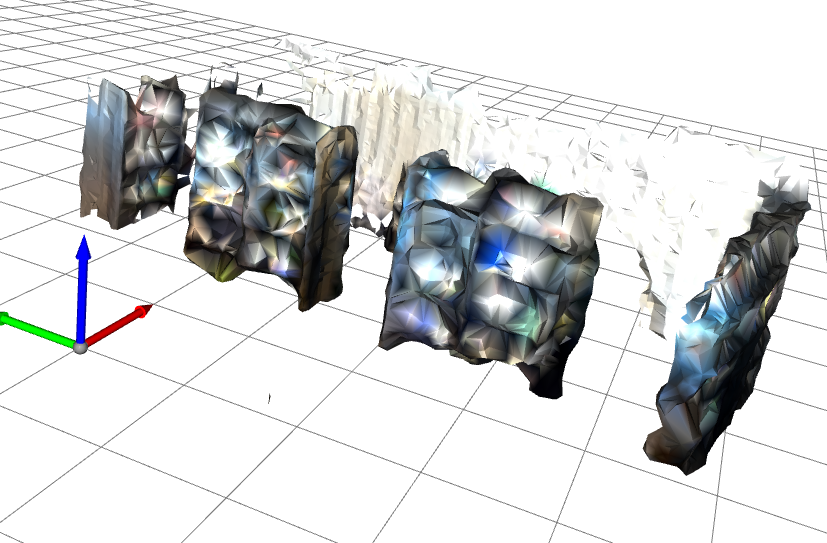
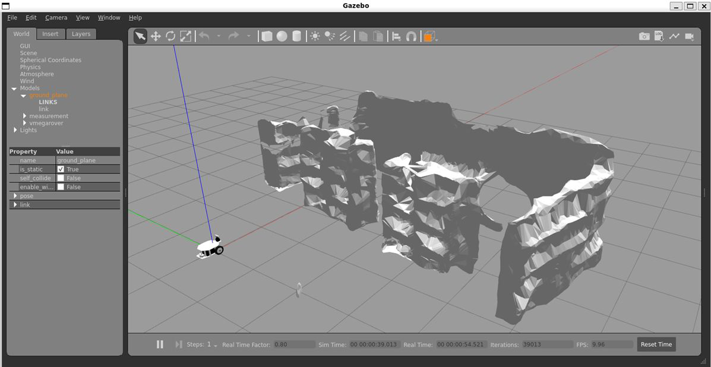
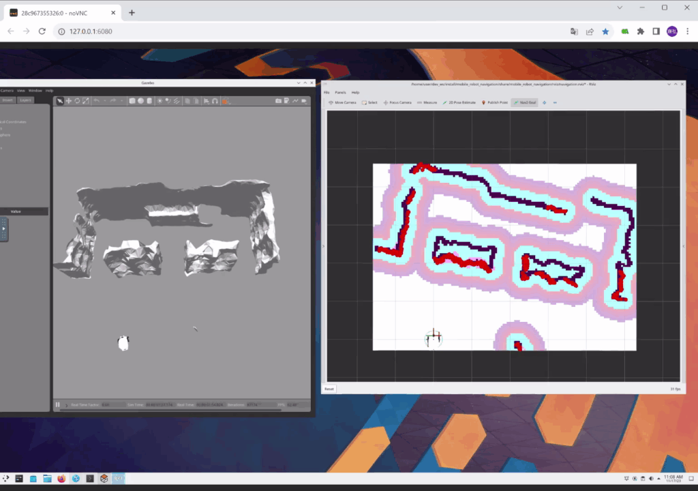

# pointcloud2gazebo

## Introduction

`pointcloud2gazebo` is a package that allows you to create a Gazebo World from a 3D point cloud.

|Input Point Cloud|Generated Mesh|Gazebo World|
|:---:|:---:|:---:|
||||

### Demo Movie

The following demo showcases a robot navigating a Gazebo World generated by this package.



## Requirements

- python ==3.10
- Open3D
- NumPy
- Traitlets

## Preparation

### Installing the Package

```shell
pip install -r requirements.txt
```

If you use Docker for setup of this tool, please execute the following command.

```shell
docker build -t pointcloud2gazebo .
./launch_container.sh
```

### Generating 3D Point Cloud Map

You will need to generate a 3D point cloud map. As an example, we have prepared [data/cloud.ply](data/cloud.ply). This data was generated using [RTAB-Map](https://apps.apple.com/td/app/rtab-map-3d-lidar-scanner/id1564774365).

## Usage

### Generating a Gazebo World

```shell
python3 generate_world.py --input=data/cloud.ply
```

If you enable to visualize mesh, please add `--vis` option.

```shell
python3 generate_world.py --input=data/cloud.ply --vis
```

If you encounter the following error, please execute `xhost +local:` before execute `generate_world.py`.

```shell
$ python3 generate_world.py --input=data/cloud.ply --vis
No protocol specified
[Open3D WARNING] GLFW Error: X11: Failed to open display :0
[Open3D WARNING] Failed to initialize GLFW
[Open3D WARNING] [DrawGeometries] Failed creating OpenGL window.
```

### Copying the Generated Gazebo World to `GAZEBO_MODEL_PATH`

```shell
mkdir -p ~/.gazebo/models
cp -r models/pointcloud2gazebo ~/.gazebo/models/
```

### Launching the Gazebo World

If you try to spawn Gazebo World generated by this package, you need to install Gazebo. Please read [official document](https://classic.gazebosim.org/tutorials?tut=install_ubuntu&cat=install).

```shell
gazebo worlds/pointcloud2gazebo.world
```

## Appendix

### Configuration

You can customize the package using [config/config.py](config/config.py).

|Parameter|Description|Type|Unit|
|---|---|---|---|
|Crop.min_z|Minimum height of points to create Gazebo world.|float|meter|
|Crop.max_z|Maximum height of points to create Gazebo world.|float|meter|
|NoiseRemoval.nb_points|Number of points within the radius. Refer to [open3d.geometry.PointCloud.remove_radius_outlier](http://www.open3d.org/docs/release/python_api/open3d.geometry.PointCloud.html#open3d.geometry.PointCloud.remove_radius_outlier).|int|-|
|NoiseRemoval.radius|Radius of the sphere. Refer to [open3d.geometry.PointCloud.remove_radius_outlier](http://www.open3d.org/docs/release/python_api/open3d.geometry.PointCloud.html#open3d.geometry.PointCloud.remove_radius_outlier).|float|meter|
|VoxelDownSample.voxel_size|Voxel size to downsample into. Refer to [open3d.geometry.PointCloud.voxel_down_sample](http://www.open3d.org/docs/release/python_api/open3d.geometry.PointCloud.html#open3d.geometry.PointCloud.voxel_down_sample).|float|meter|
|TriangleMesh.alpha|Parameter to control the shape. A large value will yield a shape close to the convex hull. Refer to [open3d.geometry.TriangleMesh.create_from_point_cloud_alpha_shape](http://www.open3d.org/docs/release/python_api/open3d.geometry.TriangleMesh.html#open3d.geometry.TriangleMesh.create_from_point_cloud_alpha_shape).|float|-|

The sample data ([data/cloud.ply](data/cloud.ply)) was generated using [RTAB-Map](https://apps.apple.com/td/app/rtab-map-3d-lidar-scanner/id1564774365). The following parameters were set for this data:

```python
c.Crop.min_z = -1.2
c.Crop.max_z = 1.0
```
